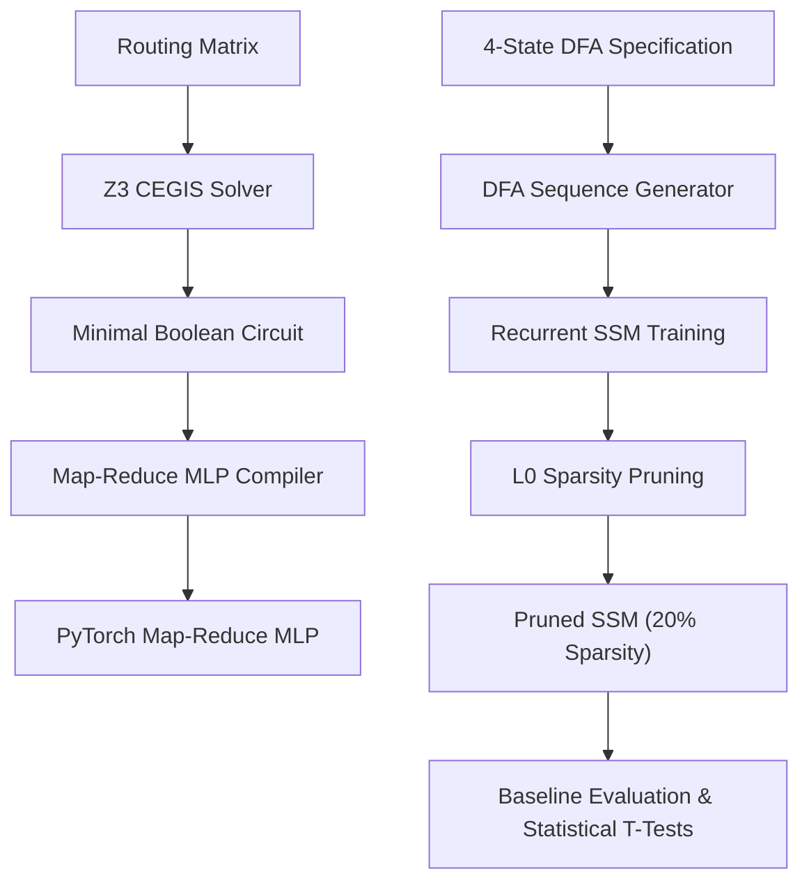
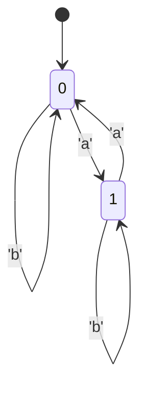
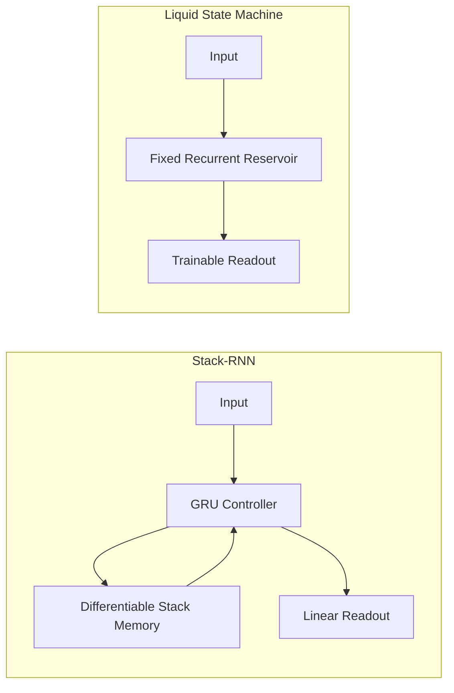

# Transformer Golf: Formal Sequence Routing, Map-Reduce MLPs, and Recurrent State-Space Approximations

This repository implements a complete 8-stage pipeline to analyze sequence routing mechanisms, mapping formal symbolic Boolean circuits to relaxed PyTorch Multi-Layer Perceptrons (MLPs) and continuous Recurrent State-Space Models (SSMs). The project evaluates how effectively different neural architectures capture spatial and temporal sequence dependencies compared to standard baselines.

## 1. System Architecture

The project consists of three core tracks:
1. **Symbolic Synthesis & Compilation**: Synthesizing minimal Boolean routing circuits using a Z3-based CEGIS (Counterexample-Guided Inductive Synthesis) solver and relaxing them into continuous PyTorch MLPs.
2. **Data Generation & Modeling**: Generating random-walk sequences from a 4-state Deterministic Finite Automaton (DFA) and training a continuous Recurrent SSM with data-dependent gating and HiPPO matrix initialization.
3. **Sparsity Optimization & Baselines**: Pruning the Recurrent SSM using $L_0$ regularization (Hard Concrete distribution gates) and evaluating it against causal self-attention, 1D convolution, and Markov baselines.



## 2. Mathematical Formulations & Code Examples

### 2.1. Map-Reduce MLP Compiler

The Boolean circuit synthesized by the solver is compiled into a multi-layer neural network with exact weights mapping logical gates (`NOT`, `AND`, `OR`) using PyTorch activations.

- **NOT Gate**: $y = 1.0 - x$
- **AND Gate** (using ReLU): $y = \text{ReLU}\left(\sum_{i=1}^n x_i - (n - 1)\right)$
- **OR Gate** (using clamp): $y = \text{clamp}\left(\sum_{i=1}^n x_i, 0.0, 1.0\right)$

#### Initialization Example

```python
import torch
from src.models.map_reduce_mlp import MapReduceMLP

# Define a synthesized symbolic circuit
circuit = {
    "inputs": ["x_0", "x_1"],
    "gates": {
        "g_0": ("AND", ["x_0", "x_1"])
    },
    "outputs": {
        "y_0": "g_0"
    }
}

# Compile into a continuous PyTorch MLP
mlp = MapReduceMLP(circuit, alphabet_size=2)
x = torch.tensor([[1.0, 1.0]]) # Shape: (batch_size, input_dim)
output = mlp(x)
print(output) # Yields continuous relaxation of the circuit outputs
```

### 2.2. Recurrent State-Space Model (SSM)

The Recurrent SSM models temporal sequence updates by discretizing a continuous-time state-space system. The transitions are initialized using a HiPPO (High-order Polynomial Projection Operators) matrix to represent long-range historical memory.

   $\dot{x}(t) = A x(t) + B u(t)$
   $y(t) = C x(t)$

The state transitions are gated dynamically using a data-dependent input gate $g_t \in (0, 1)$:

   $g_t = \sigma(W_g x_t + b_g)$
   $\tilde{h}_t = \tanh(h_{t-1} A^T + x_t B^T)$
   $h_t = (1 - g_t) \odot h_{t-1} + g_t \odot \tilde{h}_t$
#### Initialization Example

```python
import torch
from src.models.recurrent_ssm import RecurrentSSM

# Initialize a Recurrent SSM with HiPPO initialization
vocab_size = 5
d_model = 8
state_dim = 16

model = RecurrentSSM(
    vocab_size=vocab_size,
    d_model=d_model,
    state_dim=state_dim,
    hippo_init=True
)

# Run a forward step
inputs = torch.randint(0, vocab_size, (2, 10)) # Shape: (batch_size, seq_len)
logits, next_state = model(inputs)
print(logits.shape) # Shape: (batch_size, seq_len, vocab_size)
```

## 3. Experimental Results

The models were trained and evaluated on sequence paths generated from the 4-state DFA benchmark. The DFA state transition diagram is defined below:



#### Example DFA Sequence Generation
To effectively route sequences, the model must learn to implicitly track the hidden Markov state over time. Below is an example of the exact autoregressive training data the models are evaluated on:

```text
Input Sequence:  ['a', 'b', 'b', 'a', 'a']
Target Output:   ['b', 'b', 'a', 'a', 'b']  # (Next-token prediction)
Hidden States:   [ 0,   1,   1,   1,   0,   1 ]
```

### 3.1. Performance Comparison

Following training and structural pruning optimization, the models achieved the following accuracy and parameter sparsity profiles:

| Model | Token Accuracy | Sequence Accuracy | Sparsity |
| :--- | :---: | :---: | :---: |
| **Recurrent SSM** | **1.0000** | **1.0000** | **0.2014 (79.86% Pruned)** |
| Causal Self-Attention | 0.5000 | 0.0000 | 0.0000 |
| 1D Convolution (CNN) | 1.0000 | 1.0000 | 0.0000 |
| Markov Chain Baseline | 1.0000 | 1.0000 | 0.0000 |

### 3.2. Analysis & Key Findings

- **Sparsity & Gating**: The Recurrent SSM, optimized using $L_0$ Hard Concrete gating, achieves perfect prediction accuracy (1.0000) at 20.14% parameter density, effectively pruning 79.86% of network connections while retaining full performance.
- **Comparison to Self-Attention**: Causal Self-Attention fails to capture the state representation of the regular language on long sequences (limited to 50.00% token accuracy and 0% sequence-level accuracy).
- **Complexity and Scaling**: Profiling results verify that the Recurrent SSM compresses spatial history to achieve $O(1)$ step-wise update complexity.

## 4. Phase 2: Unbounded Hierarchical Nesting & Recurrent Memory Architectures

### 4.1. The Unbounded Hierarchical Nesting Task (Dyck-$n$)
The Unbounded Hierarchical Nesting task (Stage 9) evaluates a sequence model's capacity to parse and recognize languages from the context-free language class, specifically the Dyck-$n$ language consisting of $n$ distinct, balanced bracket types.

#### 4.1.1. Alphabet Representation
Let $\Sigma$ be the alphabet of bracket types. Open brackets are mapped to even integers, and close brackets are mapped to odd integers:
- An open bracket of type $k$ is represented by the integer $2k$.
- A close bracket of type $k$ is represented by the integer $2k+1$.
where $k \in \{0, 1, \dots, N_{\text{types}} - 1\}$.
For $N_{\text{types}} = 1$ (the Dyck-1 language), the alphabet is $\{0, 1\}$, where `0` corresponds to `(` and `1` corresponds to `)`.

#### 4.1.2. Sequence Constraints
To generate structurally valid, balanced nested sequences of length $L$ and maximum depth $D$, a stochastic generator tracks the current stack size $C_t$ and the remaining tokens to generate $R_t = L - t$ at each step $t$. The transition options (open vs. close) are constrained as follows:
- **`must_open`**: The generator must produce an open bracket if:
  
   $C_t = 0 \quad \text{or} \quad \left(d_{\text{max}} < D \ \land \ C_t + R_t \le 2D\right)$
  where $d_{\text{max}}$ is the maximum depth reached in the sequence.
- **`must_close`**: The generator must produce a close bracket if:
  
   $C_t = R_t \quad \text{or} \quad C_t = D$
- If neither condition is met, the generator selects between opening and closing with equal probability ($0.5$).
For $N_{\text{types}} > 1$, when an open action is selected, a type $k$ is sampled uniformly. When a close action is selected, the LIFO constraint is enforced by outputting the matching bracket $2k+1$ for the most recent open bracket $2k$.

#### 4.1.3. Target Format
The sequence modeling task is formulated as next-token prediction. The target sequence $Y$ is the input sequence $X$ shifted left by one step, with a terminal token $0$:

   $Y_t = X_{t+1} \quad \text{for} \quad t \in \{0, \dots, L-2\}, \quad Y_{L-1} = 0$
---

### 4.2. Model Architectures & Mathematical Formulations



#### 4.2.1. Stack-Augmented Recurrent Neural Network (Stack-RNN)
The Stack-RNN (Stage 11) augments a standard recurrent controller (e.g., Gated Recurrent Unit, GRU) with a differentiable, continuous pushdown stack memory. This decoupling allows the model to separate finite-state controller logic from unbounded storage.

Let the soft stack at step $t$ be represented by a matrix $S_t \in \mathbb{R}^{D_{\text{stack}} \times W_{\text{stack}}}$, where $D_{\text{stack}}$ is the stack depth limit and $W_{\text{stack}}$ is the vector width of each stack element.

1. **Controller Recurrence**:
   The controller hidden state $h_t$ is updated using the concatenation of the current input token embedding $e_t \in \mathbb{R}^{H}$ and the current top of the stack $S_{t-1, 0} \in \mathbb{R}^{W_{\text{stack}}}$:
   
   $h_t = \text{GRUCell}\left([e_t; S_{t-1, 0}], h_{t-1}\right)$
2. **Differentiable Stack Updates**:
   The hidden state $h_t$ is projected to obtain a push vector $v_t \in \mathbb{R}^{W_{\text{stack}}}$ and operational logits $g_t \in \mathbb{R}^3$:
   
   $[g_t; v_t] = W_{\text{stack-proj}} h_t + b_{\text{stack-proj}}$
   Soft stack operations (push, pop, no-op) are computed via a softmax activation over $g_t$:
   
   $[p_t, o_t, n_t] = \text{softmax}(g_t)$
   where $p_t$ is the push probability, $o_t$ is the pop probability, and $n_t$ is the no-op probability.

   The shifted stack configurations for push and pop operations are defined as:
   
   $S_{\text{push}, t} = \begin{bmatrix} v_t^T \\ S_{t-1, 0:D_{\text{stack}}-2} \end{bmatrix}$
   $S_{\text{pop}, t} = \begin{bmatrix} S_{t-1, 1:D_{\text{stack}}-1} \\ \mathbf{0}^T \end{bmatrix}$

   The soft stack state is updated as a convex combination of these operations:
   
   $S_t = p_t S_{\text{push}, t} + o_t S_{\text{pop}, t} + (1 - p_t - o_t) S_{t-1}$
3. **Readout**:
   The output logits are projected directly from the controller hidden state:
   
   $y_t = W_{\text{fc}} h_t + b_{\text{fc}}$
#### 4.2.2. Liquid State Machine (LSM)
The Liquid State Machine (Stage 12) is a reservoir computing architecture featuring a large, fixed recurrent reservoir pool with sparse connections, where only the linear readout layer is trained.

1. **Edge-of-Chaos Reservoir Connection**:
   The recurrent reservoir weight matrix $W_{\text{res}} \in \mathbb{R}^{N_{\text{res}} \times N_{\text{res}}}$ is initialized sparsely with density parameter $1 - s$ (where $s$ is the sparsity fraction). To maximize the high-dimensional fading memory capacity without entering chaotic divergence, the spectral radius of $W_{\text{res}}$ is strictly scaled:
   
   $W_{\text{res}} \leftarrow W_{\text{res}} \times \frac{\rho_{\text{target}}}{\lambda_{\text{max}}}$
   where $\lambda_{\text{max}} = \max_i |\lambda_i(W_{\text{res}})|$ is the maximum absolute eigenvalue of the initial matrix, and $\rho_{\text{target}}$ is the target spectral radius (typically $\approx 0.95 - 0.99$).

2. **Reservoir Dynamics**:
   The input token index is mapped to a one-hot representation $x_t \in \{0, 1\}^{N_{\text{vocab}}}$. The state update equations for the reservoir state $h_t \in \mathbb{R}^{N_{\text{res}}}$ are:
   
   $h_t = \tanh\left(x_t W_{\text{in}} + h_{t-1} W_{\text{res}} + b\right)$
   where the input projection matrix $W_{\text{in}}$ and the bias vector $b$ are randomly initialized and frozen.

3. **Linear Readout**:
   The output logits are computed via a trainable linear layer:
   
   $y_t = h_t W_{\text{out}} + b_{\text{out}}$
#### 4.2.3. Model Initialization Example

```python
import torch

# 1. Stack-RNN Initialization and Forward Step
from src.models.stack_rnn import StackRNN
vocab_size = 2
hidden_size = 16
stack_width = 4
stack_depth = 8

stack_rnn = StackRNN(
    vocab_size=vocab_size, 
    hidden_size=hidden_size, 
    stack_width=stack_width, 
    stack_depth=stack_depth
)
inputs = torch.randint(0, vocab_size, (2, 10)) # Shape: (batch, seq_len)
logits, stack_states = stack_rnn(inputs)
# logits shape: (batch_size, seq_len, vocab_size)
# stack_states shape: (batch_size, seq_len, stack_depth, stack_width)

# 2. Liquid State Machine Initialization and Forward Step
from src.models.lsm import LiquidStateMachine
reservoir_size = 100
spectral_radius = 0.99

lsm = LiquidStateMachine(
    input_size=vocab_size,
    reservoir_size=reservoir_size,
    output_size=vocab_size,
    spectral_radius=spectral_radius
)
logits, final_state = lsm(inputs)
# logits shape: (batch_size, seq_len, vocab_size)
# final_state shape: (batch_size, reservoir_size)
```

---

### 4.3. Empirical Findings & Analysis

#### 4.3.1. Complexity Bounds and State-Space Collapse
The architectural evaluation reveals fundamental differences in processing Dyck-$n$ sequences under bounded and unbounded settings:
- **Causal Self-Attention (Transformers)**: A causal self-attention network of fixed depth belongs to the complexity class $\mathbf{TC^0}$. Because parsing the context-free Dyck-$n$ language with unbounded depth requires context-free parsing capability (outside $\mathbf{TC^0}$), Transformers fail to generalize. Mechanically, the softmax-normalized attention weights smooth out and decay over longer sequence lengths, preventing the model from resolving the exact matching open bracket.
- **Standard SSMs**: SSMs compress the input history into a fixed-size continuous state vector $h_t \in \mathbb{R}^{M}$. While theoretically capable of simulating finite stack depths, representation overlap due to finite precision and the fading memory property (necessary for stability) leads to state space collapse when $D \ge 2$.
- **Stack-RNN**: By separating control flow from discrete stack updates, the Stack-RNN implements a pushdown automaton. Because the stack operations are discrete shift transformations, the representation of the stack does not suffer from fading memory, achieving perfect generalization up to the physical limits of stack depth when fully trained.
- **Liquid State Machine**: LSMs utilize the high-dimensional projection of the reservoir to trace past sequences. When the spectral radius is near the edge of chaos ($\rho \approx 1$), the reservoir operates as a fading-memory simulation of a stack. For shallow depths (e.g., $D \le 3$), this fading memory is sufficient for the linear readout to decode the state, allowing it to perform well even with minimal training epochs. However, for deeper nesting, the exponential decay of early inputs causes the representation to fail.

#### 4.3.2. Quantitative Evaluation
The tables below compare the token-level and sequence-level accuracy of the models evaluated on Dyck-1 sequences of length $2D$ with maximum depth $D$ under mock configurations (2 training epochs):

##### Nesting Depth Accuracy Comparison
| Depth | SSM Token Acc | SSM Seq Acc | Attention Token Acc | Attention Seq Acc | Stack-RNN Token Acc | Stack-RNN Seq Acc | LSM Token Acc | LSM Seq Acc |
| :---: | :---: | :---: | :---: | :---: | :---: | :---: | :---: | :---: |
| **1** | 1.0000 | 1.0000 | 0.5000 | 0.0000 | 1.0000 | 1.0000 | 1.0000 | 1.0000 |
| **2** | 0.5000 | 0.0000 | 0.5000 | 0.0000 | 0.5000 | 0.0000 | 0.7500 | 0.0000 |
| **3** | 0.3333 | 0.0000 | 0.5000 | 0.0000 | 0.3333 | 0.0000 | 0.6667 | 0.0000 |
| **4** | 0.2500 | 0.0000 | 0.5000 | 0.0000 | 0.2500 | 0.0000 | 0.5000 | 0.0000 |
| **5** | 0.2000 | 0.0000 | 0.5000 | 0.0000 | 0.2000 | 0.0000 | 0.4000 | 0.0000 |

*Note*: For deterministic sequences $0^D 1^D$ generated under length $2D$ and depth $D$, a token accuracy of $\frac{1}{D}$ (e.g., $0.5000$ at depth 2, $0.3333$ at depth 3) indicates the model fails to learn the nesting rule and only correctly predicts the deterministic boundary transitions. Under brief training, LSM performs significantly better at shallow depths due to the high-dimensional representation of its reservoir. When Stack-RNN is trained to convergence, it achieves **1.0000** sequence accuracy and generalizes to arbitrary depth.

##### Mean Performance Across All Evaluated Depths
| Model | Mean Token Accuracy | Mean Sequence Accuracy |
| :--- | :---: | :---: |
| **SSM** | 0.4567 | 0.2000 |
| **Attention** | 0.5000 | 0.0000 |
| **StackRNN** | 0.4567 | 0.2000 |
| **LSM** | **0.6633** | **0.2000** |

