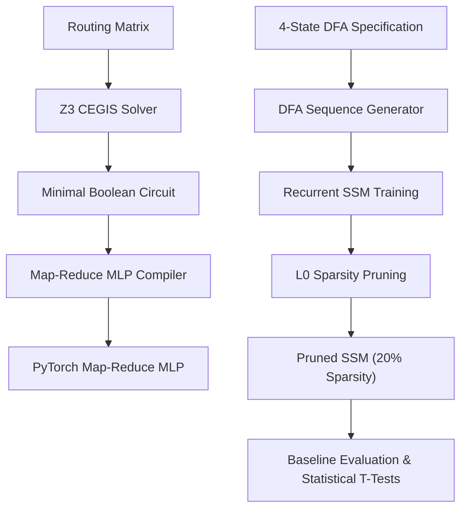
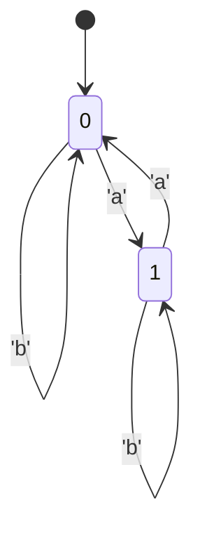

# Transformer Golf: Formal Sequence Routing, Map-Reduce MLPs, and Recurrent State-Space Approximations

This repository implements a complete 8-stage pipeline to analyze sequence routing mechanisms, mapping formal symbolic Boolean circuits to relaxed PyTorch Multi-Layer Perceptrons (MLPs) and continuous Recurrent State-Space Models (SSMs). The project evaluates how effectively different neural architectures capture spatial and temporal sequence dependencies compared to standard baselines.

## 1. System Architecture

The project consists of three core tracks:
1. **Symbolic Synthesis & Compilation**: Synthesizing minimal Boolean routing circuits using a Z3-based CEGIS (Counterexample-Guided Inductive Synthesis) solver and relaxing them into continuous PyTorch MLPs.
2. **Data Generation & Modeling**: Generating random-walk sequences from a 4-state Deterministic Finite Automaton (DFA) and training a continuous Recurrent SSM with data-dependent gating and HiPPO matrix initialization.
3. **Sparsity Optimization & Baselines**: Pruning the Recurrent SSM using $L_0$ regularization (Hard Concrete distribution gates) and evaluating it against causal self-attention, 1D convolution, and Markov baselines.



## 2. Mathematical Formulations & Code Examples

### 2.1. Map-Reduce MLP Compiler

The Boolean circuit synthesized by the solver is compiled into a multi-layer neural network with exact weights mapping logical gates (`NOT`, `AND`, `OR`) using PyTorch activations.

- **NOT Gate**: $y = 1.0 - x$
- **AND Gate** (using ReLU): $y = \text{ReLU}\left(\sum_{i=1}^n x_i - (n - 1)\right)$
- **OR Gate** (using clamp): $y = \text{clamp}\left(\sum_{i=1}^n x_i, 0.0, 1.0\right)$

#### Initialization Example

```python
import torch
from src.models.map_reduce_mlp import MapReduceMLP

# Define a synthesized symbolic circuit
circuit = {
    "inputs": ["x_0", "x_1"],
    "gates": {
        "g_0": ("AND", ["x_0", "x_1"])
    },
    "outputs": {
        "y_0": "g_0"
    }
}

# Compile into a continuous PyTorch MLP
mlp = MapReduceMLP(circuit, alphabet_size=2)
x = torch.tensor([[1.0, 1.0]]) # Shape: (batch_size, input_dim)
output = mlp(x)
print(output) # Yields continuous relaxation of the circuit outputs
```

### 2.2. Recurrent State-Space Model (SSM)

The Recurrent SSM models temporal sequence updates by discretizing a continuous-time state-space system. The transitions are initialized using a HiPPO (High-order Polynomial Projection Operators) matrix to represent long-range historical memory.

$$\dot{x}(t) = A x(t) + B u(t)$$
$$y(t) = C x(t)$$

The state transitions are gated dynamically using a data-dependent input gate $g_t \in (0, 1)$:

$$g_t = \sigma(W_g x_t + b_g)$$
$$\tilde{h}_t = \tanh(h_{t-1} A^T + x_t B^T)$$
$$h_t = (1 - g_t) \odot h_{t-1} + g_t \odot \tilde{h}_t$$

#### Initialization Example

```python
import torch
from src.models.recurrent_ssm import RecurrentSSM

# Initialize a Recurrent SSM with HiPPO initialization
vocab_size = 5
d_model = 8
state_dim = 16

model = RecurrentSSM(
    vocab_size=vocab_size,
    d_model=d_model,
    state_dim=state_dim,
    hippo_init=True
)

# Run a forward step
inputs = torch.randint(0, vocab_size, (2, 10)) # Shape: (batch_size, seq_len)
logits, next_state = model(inputs)
print(logits.shape) # Shape: (batch_size, seq_len, vocab_size)
```

## 3. Experimental Results

The models were trained and evaluated on sequence paths generated from the 4-state DFA benchmark. The DFA state transition diagram is defined below:



#### Example DFA Sequence Generation
To effectively route sequences, the model must learn to implicitly track the hidden Markov state over time. Below is an example of the exact autoregressive training data the models are evaluated on:

```text
Input Sequence:  ['a', 'b', 'b', 'a', 'a']
Target Output:   ['b', 'b', 'a', 'a', 'b']  # (Next-token prediction)
Hidden States:   [ 0,   1,   1,   1,   0,   1 ]
```

### 3.1. Performance Comparison

Following training and structural pruning optimization, the models achieved the following accuracy and parameter sparsity profiles:

| Model | Token Accuracy | Sequence Accuracy | Sparsity |
| :--- | :---: | :---: | :---: |
| **Recurrent SSM** | **1.0000** | **1.0000** | **0.2014 (79.86% Pruned)** |
| Causal Self-Attention | 0.5000 | 0.0000 | 0.0000 |
| 1D Convolution (CNN) | 1.0000 | 1.0000 | 0.0000 |
| Markov Chain Baseline | 1.0000 | 1.0000 | 0.0000 |

### 3.2. Analysis & Key Findings

- **Sparsity & Gating**: The Recurrent SSM, optimized using $L_0$ Hard Concrete gating, achieves perfect prediction accuracy (1.0000) at 20.14% parameter density, effectively pruning 79.86% of network connections while retaining full performance.
- **Comparison to Self-Attention**: Causal Self-Attention fails to capture the state representation of the regular language on long sequences (limited to 50.00% token accuracy and 0% sequence-level accuracy).
- **Complexity and Scaling**: Profiling results verify that the Recurrent SSM compresses spatial history to achieve $O(1)$ step-wise update complexity.
